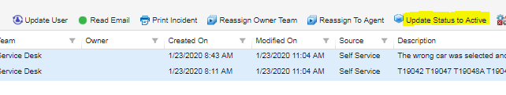
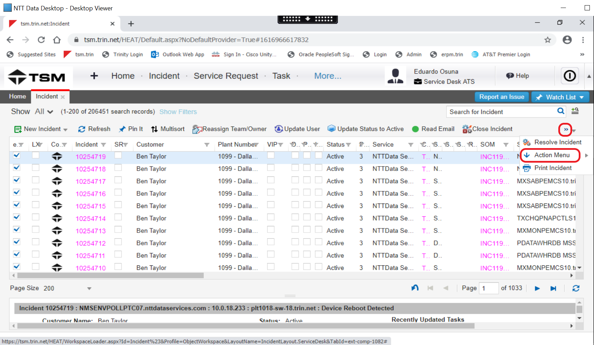
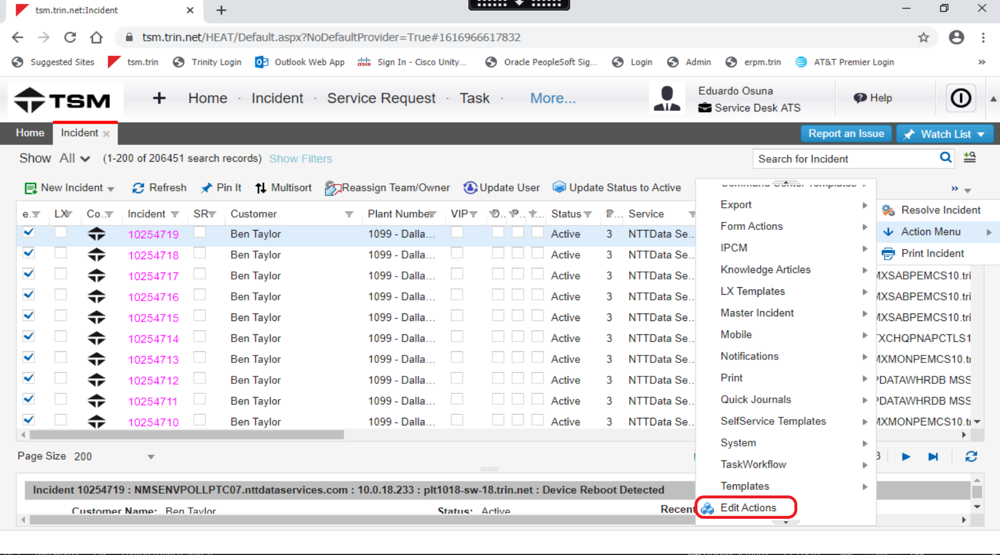
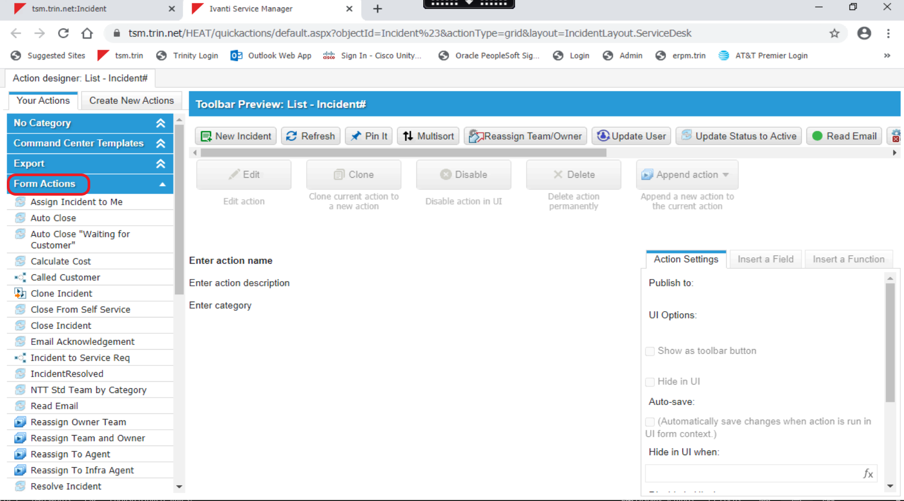
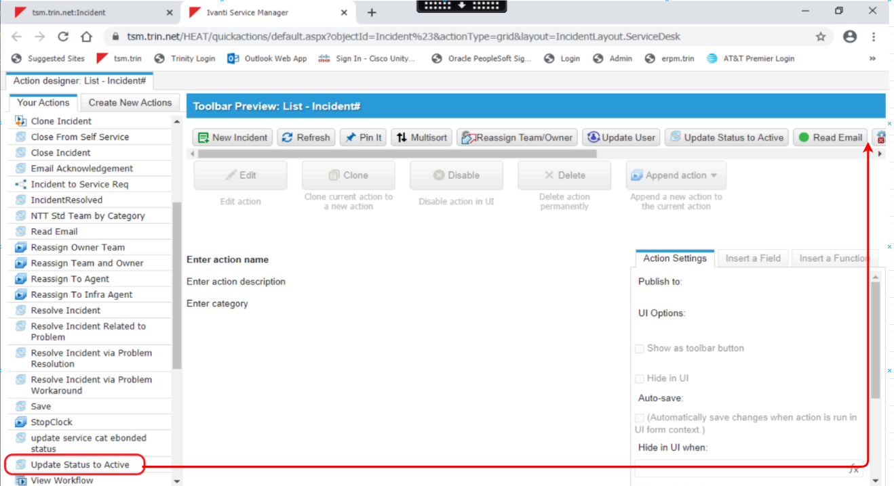
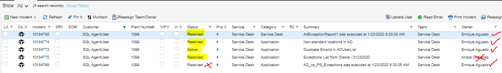
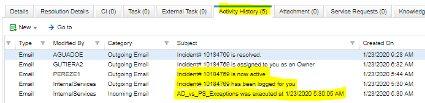
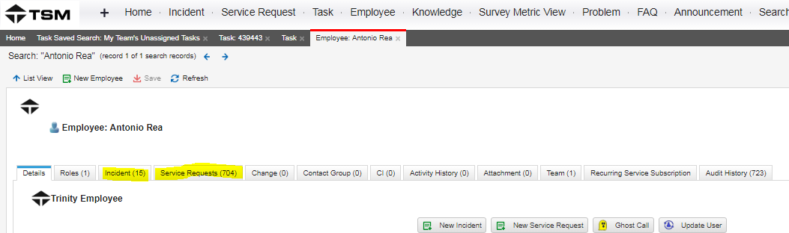
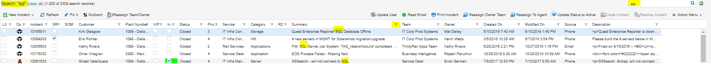
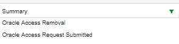

# ATS Process - Incident's Queue Management
## Task Names: N/A

  

| Author: Eduardo Osuna|  Account: Trinity         |
|:-------------------- |:--------------------------|
| Version: 1.0         | Document type: Knowledge  |
| Creation  Date       | Last Modification:        |
| Owner: Eduardo Osuna | Last modification made by:|

  
  
  
  
  
  
  
  
  
  
  
  
  
  

### Incident Queue Management

The Incident Queue Manager role is in charge to distribute Inident's workload in an equitative and fair way. As part of this role's function is to review all Self service incident's tickets that arrive and assign them to the proppper resolver group or if is there any action required from Service Desk to have it assigned to an agent.

### Reviewing Incident Queue

1. Open the Incident tab, if the tab does not automatically go to the *Unassigned self service incidents* option, it will need to be opened from the scroll down menu:

2. It is imperative that the incidents incoming is changed from “Logged” to “Active” status within 4 hours at the most, that the incident came in otherwise we will be breaching the SLA stablished.

> Select the incidents in *Logged* Status in the queue and click on *Update Status to active* 

### Activate *Update Status to active* button

If the button *Update Status to active* is not visible on your profile follow the steps below to have it activated:

1. Go to *Action Menu*.

2. Select *Edit Actions*.

3. On the new tab that will open on your browser open the dropdown menu *Form Actions*. 

4. Locate the *Update Status to active* option and use drag and drop to add it to your menu bar.

### Exception Report Incidents

There will be exception reports incoming to this queue, they need to be reviewed so that if nothing is reported, the ticket will be assigned to the person in charge of the Incident Queue and closed with the pertinent notes. On the other hand, if there is an exception reported, it will be assigned directly to the person in charge of the report that week.

In the above example the owner is crossed with a red X because it was not assigned to the correct person and the status is crossed with a red X because that incident needs to be closed ONLY once the exits corresponding to the reported users in terminated status have been submitted and not before.

Every ticket needs to be opened and reviewed to determine the action taken. It is imperative to check the *Activity history* tab in the ticket to determine if the ticket has been bounced back from another team. Generally, more than 3 notes would mean that the ticket needs more attention as it may have been returned to our queue or additional notes have been included.

In the example below, the three notes highlighted, are the automatic ones every ticket has when they are opened.

Tickets that need a service request opened require Incident Queue Manager to log a note on *Activity history* explaining what is required and handed over to a Service Desk agent. 
Tickets resolvable by a Service Desk agent needs to be assigned to them as well.

> **Tip:** Use TSM to search in the knowledge base or in TSM “historic records” for similar cases to base on if the information available to you does not suffice and you become unsure on how to proceed.

### Reviewing Historic Records

1. Open the “employee” tab and then click on the “service requests” tab to search for similar cases, you may want to check under the “incidents” tab too for a lead.

2. Search in general tickets related to the case. You can expand the search by filtering the summary column with key words related to your search.

### Oracle Access Requests

All “Oracle Access Request Submitted” and “Oracle Access Removal” need to be assigned to you as you are the manager of the queue.

> These incidents need to be worked in a timely manner as we have 3 days to have them completed or the SLA will breach. Refer to the Oracle Access document for further details.

> ***NOTE:*** New procedures are to be implemented regarding messaging tickets, for the moment they need to be reviewed by us and if procedure is unknown or restricted to our team, it needs to be consulted with Ryan Kinnear.

