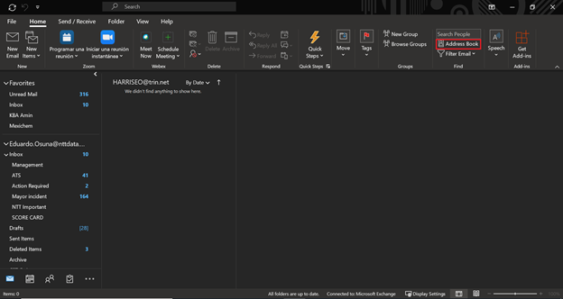
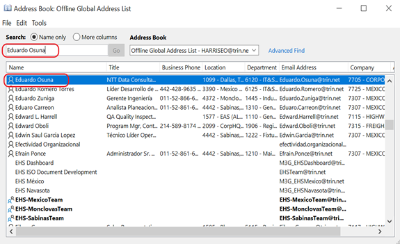
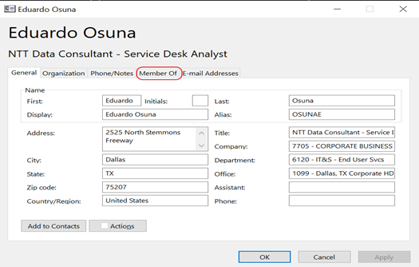
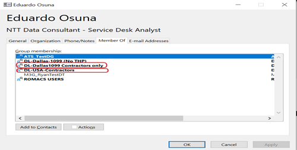
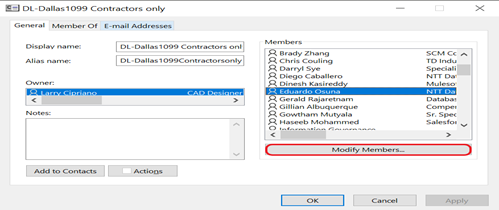

# ATS Process - Remove user from Distribution Lists
## Task Name: Remove Users from DL's
|Author: Eduardo Osuna | Account: Trinity|
|-------------------------|-----------------------------------|
|Version: 1.0             |Document type: Knowledge           |
|Creation Date: 03/28/2021|Last Modification:                 |
|Owner: Eduardo Osuina    |Last modification made by:         |

  
  
  
  
  
  
  
  
  
  
  
  
  
  

### Distribution lists

Listed below are the DLs that we can remove users from:
1. DL-CAN-Contractors
2. DL-CAN-Employees
3. DL-Dallas1099 Contractors Only
4. DL-Dallas1099 Employees Only
5. DL-MEX-Contractors
6. DL-Mex-Employees
7. DL-USA-Contractors
8. DL-USA-Employees

### Find User:

1. First open Microsoft Outlook and head to the option "Address Book" on the options ribbon *Home*.

2. On the *Search Bar* type user's name. No need to click on Enter since the application would immediately show all the approximate results.

### Check Membership

1. Double click on the user's name to get into the user's profile card and lick on *Member of* Tab.

2. As per the [Listed Distribution Lists](#Distribution-Lists) mentioned at the beginning of this document locate the lists the user is member of.

### Removal Process

1. Double click on the Distribution list name so its information is displayed
2. On the *Members* square you will find a list of the users added to the selected distribution list. Click on *Modify Members...* to open *Contact Group Membership* list.

3. Locate the user that needs to be removed by scrolling down or up, or by typing the user's name on the *Contact Group Membership* list. Afterwards click on the button *Removed*.

4. Repeat the process with all the Distribution lists the user is member of.

> **Remember** to only this procedure on the [Listed Distribution Lists](#Distribution-Lists) mentioned at the beginning of this document.

5. When entering the clousure notes on your task remember the user name and the distribution lists he/she was removed from:

> *"User Eduardo Osuna has been removed from the following distribution lists:
DL-Dallas1099Contractors Only
DL-USA-Contractors”*

