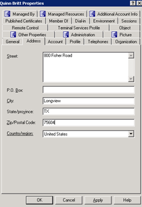

# ATS Process - New hire – Network account creation
## Task names: AD & Email Account Setup for New Hire

|Author: Eduardo Osuna | Account: Trinity|
|-------------------------|-----------------------------------|
|Version: 1.0             |Document type: Knowledge           |
|Creation Date: 03/28/2021|Last Modification:                 |
|Owner: Eduardo Osuna     |Last modification made by:         |

  
  
  
  
  
  
  
  
  
  
  
  
  
  

### AD and Email

These kind of tasks can include three kind of requirements. 

1. Network Account creation which is the main requirement.

> This Requirement is always present on this Service Request.

2. Network Account with Email address.
3. Network Account with VPN Access.

> This last one might or not include Email Address as well.

To have this tasks completed is needed to be sure of which path is to be chosen according with the requirements requested.

**Network Account with and Email Account**

To have a Network account only we need to have the new user created on the following path in Active Role Console:

Network account with Email Account
ARS path: Quest One ActiveRoles> Configuration > Managed Units> _Trinity > Service Desk > TRN Provision w/ Mailbox > Users.

Network account without Email Account
ARS path: Quest One ActiveRoles> Configuration > Managed Units> _Trinity > Service Desk > TRN Provision w/o Mailbox > Users.

## Staging Steps

Follow the below steps to create the Network account. 

1. Open *Quest One Active Roles Console* and follow the path specified 
above 

2. Click on the icon shaped as a little face (New User) to create the new user on the path specified path (you may also right click inside the folder and click *New User*) 

3. Fill the all the fields with the user's information specified on the request. 

4. Click on *AB* button to generate the network user name and click on Next.

5. Ensure there are no duplicates in the database. This can be done by checking the username (user´s name) in AD specially if it comes up with a number.

6. Create Password (First name initial uppercase + Last name initial lowercase + Employee number + If needed add zeros to comply with password length *8 characters minimum) Make sure 'User must change password at next logon' is checked.  Click next. 

7. Click and edit the following fields depending on the new hire request form:

- Enter Cost center with the configuration Physical plant number + Department .number (Plant 2099 + Department 6120 > Cost Center: 209961201.
- Country/Region > United States or Mexico.
- edsva-trn-Provisioning Ticket Number > Enter the provisioning ticket number.
- edsva-trn-VIPUser > If user is marked as VIP, select the VIP tag.
- employeeNumber > Type or copy and paste user's employee number from new hire form request.
- Manager > Double click on the field to be populated and then on the three dotted button, search for manager with e-mail. Click OK. (Make sure DN syntax appears in Value [see below]).
    
    
- employeeType > Select *User* for all defined as direct employees and *Contractor* for all others.
- o > The field *o* is destined for the business unit. To have it filled just type the number described on the new hire form request on the dropdown menu (shortcut: Type P# and press the *Down* with the your directionl path on your keyboard).
- officeLocation > Type office number from new hire form and select correct option from drop down menu.  (shortcut: Type P# and press the *Down* with the your directionl path on your keyboard).

8. Add Properties:

- General Tab > Verify user's information is correct.
- Address Tab > Fill in physical address from new new hire request form, city, state code only (unless from Mexico) and zip code.

- Account Tab > Set *Expiration Date* based on type of employee:
  - Regular employee > Never.
  - Contractor > 90 Days.
  - ASC Contractor > Feb 15 of following year (**Note:** Remember to add EXL Desktop Icon in AD for this cases).
  - NTT Contractor > Jan 1 of following year.

  

  - Profile Tab > Check and make sure that Home Drive was succesfully created. 
  - Telephone Tab > Leave as it is.
  - Organization Tab > Copy and paste “Title”, “Department”, “Company” (Labeled as BU# in NHF)from new hire form and make sure the Manager's name is correct.

  

9. Look up the new user in AD and verify information is accurate and e-mail has been created automatically, if so proceed to email the requester and manager (*If user is from Mexico, only email manager) with [New Hire Template](#New-Hire-Template).

> **Note:** The user's mailbox is created automatically depending on the path in which the new user was created.

## EAC

If the new user was requested to be created with an Eail account then will need to be added to the *Azure* O365AllowGroupCreation security group.

To complete this task follow the steps below:

1. Log into your EAC account and search for the new user with *Login ID* and double click on user's name.

2. Click on *Manage Groups*.

3. Clik on *Add Memberships*.

4. Search for the group *O365AllowGroupCreation*, double click on it and add user to the group then click *Save*.

5. Open *Manage Groups*, search for the group *O365AllowGroupCreation* and double click to confirm that the user's name has been added correctly.

## VPN

If the new user is requested to have access to VPN then we need to follow the steps below:

1. Search for user's name on ARS and double click on his name to open his/her Active Directory Profile card.

2. Go to *Member of* Tab and clic on *Add*.

3. Add the Security group ***2FA_MobilePass_Auth***. 

> **Note:** All NTT contractors must be added to *2FA_MobilePass_CitrixAuth* security group.

## Users without Email

1. Create the account under the “TRN Provision w/o Mailbox > Users”
2. Third party e-mail should be provided by the requestor. Search in notes or attachments in TSM. If
the email was not found, contact the requester to obtain it.
3. Once the third party email was obtained go to Active Directory “General” tab and add the email in the email box and then add the VPN group as stated above.

## New Hire Template

After Active Directory account is created a notification email is sent to user’s manager with New hire information:

Hello *Requester’s Name*,

Below is the login information for *User's Name*

Username: **

Temp Password: **

Employee#: **

Email: **

> Account Expires: (Expiration date if applies)

If the user is working remotely, please have them log in to www.owa.trin.net. They will be prompted to change their password and then they may setup the VPN.

Regards,

(ATS Signature)

