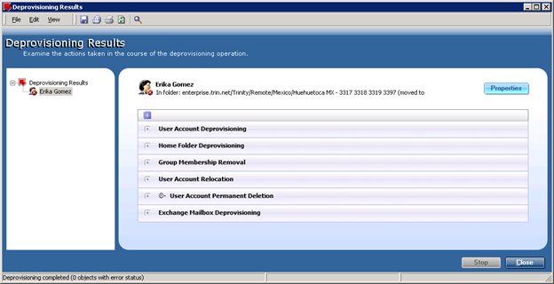

# ATS Process - De-Provision Task

### Task names: Active Directory - De-Provision Active Directory Account Access

### MX Exit - Active Directory

  

| Author: Eduardo Osuna|  Account: Trinity         |
|:-------------------- |:--------------------------|
| Version: 1.0         | Document type: Knowledge  |
| Creation  Date       | Last Modification:        |
| Owner: Eduardo Osuna | Last modification made by:|

  
  
  
  
  
  
  
  
  
  
  
  
  
  

The purpose of this document is to provide information about how to process an EXIT for US employees.

> **Note:** EXITs must be processed within 3 business days per SOX (Sarbanes-Oxley) standards.

The ticket will request that all access be removed for an employee

The “Service Request” should be auto generated based on the Employee EXIT Submittal Process documentation through TSM(HEAT).  As shown above, EXIT’s have their own section based on submittal.

Open the ticket in question within TSM(HEAT).

The “Requestor” for the EXIT will be listed in the “Customer” field.
Please validate that this individual is either with HR or is the appropriate Manager for the individual being EXITed. If NOT, please contact the manager in question or HR representative to valid the termination of the employee unless it is an Audit.

The information at the bottom of the EXIT request ticket will contain the information for the individual being Exited. Please validate the information accordingly as mentioned above.

The Login ID, Employee ID and Email address will be listed here for ease of access and verification for access removal later. (If an email address shows up with TSM.(EID)@trin.net, the user did not have an email address in use and an email address was generated for them for the purpose of showing the account in TSM(HEAT).)

Note: When an “AD Exception Report” is received, it must be attached to each exit ticket that is created. Always notate the date you received the exception report.

Go to the Jump Server TXCRPPRDSS10.

Open ARS (with your Harris account) and then right-click on Active Directory and Find.

Type the user’s name in the Name field and click Find Now.  Locate the user’s name in the list results.

If there is more than one person with the same name or you are unsure that that profile is that of your user, double-click on the person’s name to open the profile to verify their employee number which is listed under the **Other Properties Tab**.  Make sure you are Exiting the correct person.

>**Note:** US employee numbers are not listed in the description.

Right-click on the user’s name and select **Deprovision** from the drop-down list.

A screen will appear showing the progress.

When it has completed, click **OK**.

>**Note:** For all Employees being exited you must search within ARS to see if they have an elevated account. To do so, search by Last name only or First name only.

If found in ARS you will see within description **“MIS Account Operators: Privileged account for X user”**. You will then create a generic service request and assign the TASK and the actual service request to Information Security so they may de-provision it.

Click on user's name

Click the plus (+) sign to expand the details for **User Account Deprovisioning**.

Go back to the Request in TSM, select and accept the task named “Active director-DE-provision active directory account”. When ready to complete the task, click on the “Complete” icon.

Copy the **Deprovisioning** confirmation information from ARS and paste the information into the **Resolution notes** portion of the TSM(HEAT) ticket.
